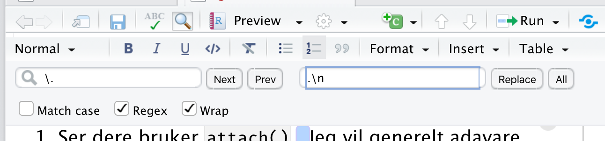

# Generelle kommentarer

1.  Ser dere bruker `attach()` . Jeg vil generelt adavare dere mot å bruke `attach()` . Det er flere grunner til dette:

    i.  Vi vil så langt det er mulig prøve å bruke pipes og funksjoner fra Tidyverse. Da er `attach()` overflødig.

    ii. Det er svært lett å bli forvirret av `attach()` . Funksjonen legger data.frame-en til search-path. Er man uheldig å utfører attach() flere ganger må man også utføre detach() tilsvarende antall ganger for å ta den bort fra search-path.

    iii. Her er en god diskusjon av problemene med attach: [To attach() or not attach(): that is the question](https://www.r-bloggers.com/2011/05/to-attach-or-not-attach-that-is-the-question/)

2.  Det er en generell anbefaling å bruke linjeskift etter hvert punktum i brødteksten. Dette vil gjøre sync-ing vha. gir/github lettere.

    i.  En lett måte å fikse det på er å benytte `Find…` og så hake av for Regex og benytte ". " som Find-tekst og ".\n" som Replace-tekst.

3.  Ton ned påstander. Eks. "Her er variablene ikke normalforselt ...", bedre å skrive "Histogrammet tyder på at denne variabelen ikke er normalfordelt ...". Sterke påstander er lettere å angripe hvis noen skulle være uenig.

4.   Prøv å benytte pipes og tidyverse. Jeg tror dette er fremtiden og det gir bedre kode når en bare blir vant til det

5.  En grei analyse, men dere burde kanskje tatt mer hensyn til kjønn. Se mitt forslag i den siste facet figuren.
